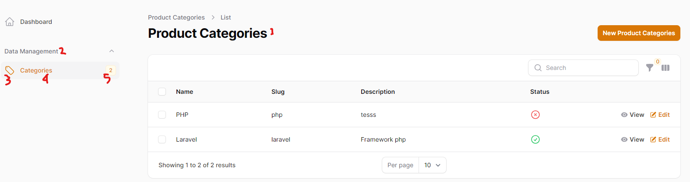

# List Category Page Setting 

## File : CategoryResource.php

- 01 protected static ?string $modelLabel = 'Product Categories';
- 02 protected static ?string $navigationGroup = 'Data Management';
- 03 protected static ?string $navigationIcon = 'heroicon-o-tag';
- 04 protected static ?string $navigationLabel = 'Categories';
- 05  public static function getNavigationBadge(): ?string
   ` {
        return static::getModel()::count();
    } `

