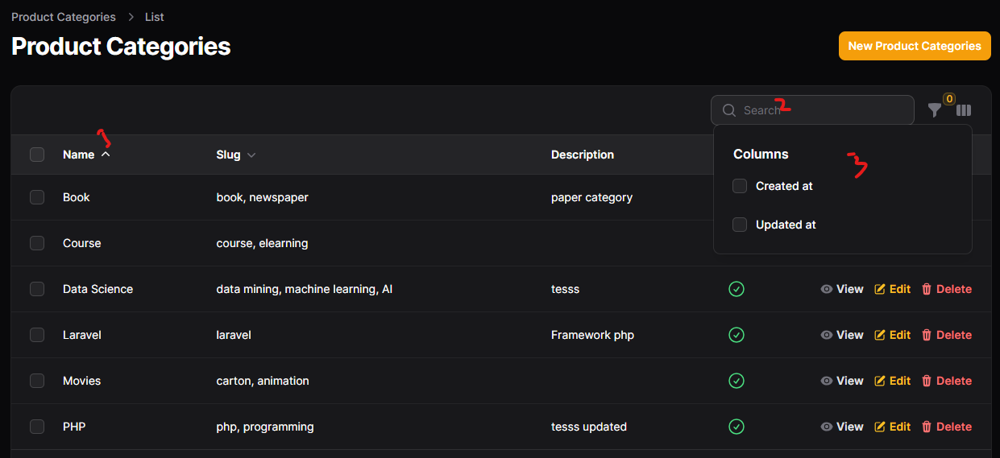

# Sort, Search and hidden column

 ## 1 (sort) $table->columns([
    Tables\Columns\TextColumn::make('name')->sortable()
## 2 (search) $table->columns([
    Tables\Columns\TextColumn::make('name')->searhable()
## 3 (toggle hidden) 
    Tables\Columns\TextColumn::make('description')
        ->toggleable(isToggledHiddenByDefault: true)(),    